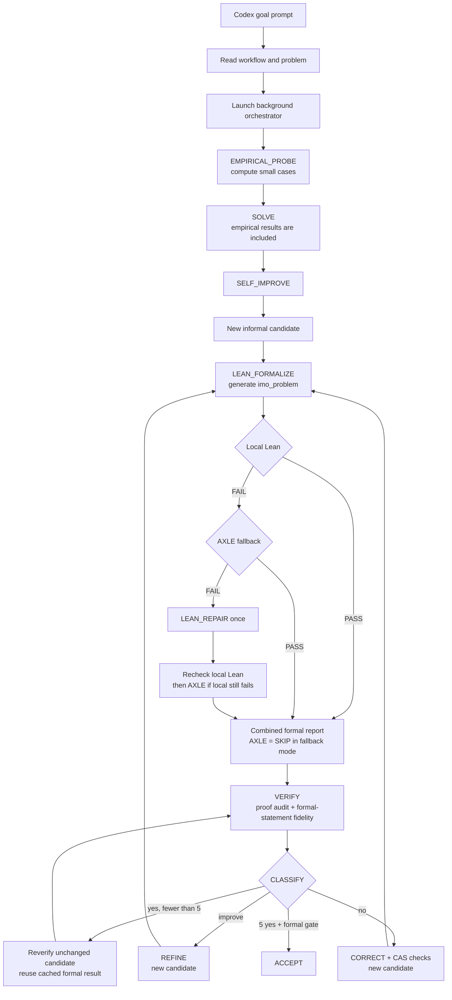

# Direct solver workflow for Codex Desktop

This workflow lets Codex Desktop launch and monitor a durable background solver.
The Desktop agent is an orchestrator only; it must not solve, grade, or rewrite
the mathematics itself.

## Setup

1. Read the problem file from problems/.
2. Read code/prompts.py and code/orchestrator.py to understand the algorithm.
3. Create a fresh run directory: /tmp/imo26-<problem-id>-<UTC-timestamp>.

## End-to-end flow

The goal prompt starts Codex, but Codex does not solve the problem itself. It
reads this workflow, launches `code/orchestrator.py`, and monitors the artifacts
that the background process produces.

Stage boundaries:

1. `EMPIRICAL_PROBE` generates and executes a small-case Python program. Its
   printed results are included in the `SOLVE` request.
2. `SOLVE` and `SELF_IMPROVE` produce the informal olympiad solution. Lean and
   AXLE are not used in these stages.
3. `LEAN_FORMALIZE` asks the model to translate each new informal candidate
   into a theorem named `imo_problem`. This translation is model-generated;
   neither Lean nor AXLE determines whether it faithfully represents the
   original problem.
4. Local Lean checks the generated source first. Under the prompt-selected
   `--axle-mode fallback`, AXLE is attempted only if local Lean fails. The
   shared policy check can reject a missing `imo_problem`, proof hole, or
   disallowed declaration before any upload. If both backends fail,
   `LEAN_REPAIR` gets the combined report and makes one repair attempt.
5. `VERIFY` receives the problem, informal candidate, Lean source, and combined
   formal report. It must separately audit whether `imo_problem` is a faithful
   encoding; a compiled proof of a weakened theorem is still a Critical Error.
6. `CLASSIFY` returns `yes`, `improve`, or `no`. A required formal-gate failure
   cannot be classified as `yes`. Refinement or correction creates a new
   candidate and therefore triggers a new formalization and formal check.
7. Re-verifying an unchanged candidate reuses its cached Lean/AXLE result. It
   does not repeatedly submit identical source to AXLE while accumulating the
   five required verifier passes.

AXLE never performs `EMPIRICAL_PROBE`, `SOLVE`, `SELF_IMPROVE`, `VERIFY`,
`CLASSIFY`, CAS checks, or the informal correction itself. It is only a hosted
Lean checker for the generated source.

Formal-stage artifacts in `run_XX/`:

| Artifact | Meaning |
| --- | --- |
| `candidate_NN.md` | Informal solution candidate |
| `candidate_NN.lean` | First Lean formalization of that candidate |
| `candidate_NN_lean_retry.lean` | One repaired formalization, when needed |
| `lean_verify_NN.txt` | Combined local Lean and AXLE result plus final Lean source |
| `verify_YY.md` | Mathematical proof audit and formal-statement fidelity audit |
| `classify_YY.md` | `yes`, `improve`, or `no` verdict |

AXLE does not write a separate report file. Its PASS, FAIL, or SKIP result is
embedded in `lean_verify_NN.txt`.

## Transport

The orchestrator makes OpenAI-compatible chat completion calls directly to the
configured model endpoint. Always pass --api-url, --api-key, and --model
explicitly as command-line arguments. Do not rely on environment variable
inheritance.

Direct IP endpoint:
    - API URL: http://165.245.166.41:30000/v1/chat/completions
    - Token: onenx-dev-JgZ0YeSTHeTVh057uomgjF02
    - Model: GLM-5.2-FP8

Never print or persist the token. Extract it at runtime without exposing values.

The orchestrator encodes proven defaults: max_tokens=256000,
thinking_budget=200000, HTTP_TIMEOUT=5400, MAX_TRANSPORT_RETRIES=3,
MAX_ERRORS=3 (consecutive failures before run restart), REQUIRED_PASSES=5,
WALL_CLOCK_TIMEOUT=5400 (90 minutes per API call),
CORRECT_MAX_TOKENS=128000 and CORRECT_THINKING_BUDGET=100000 for CORRECT/REFINE calls.

The orchestrator uses streaming mode (stream=True) with SSE chunk parsing
and stream_options={"include_usage": true} to capture token counts. Streaming
keeps the connection alive during long generation (20-60 min per SOLVE call)
and prevents the server from closing idle non-streaming connections.

## Launch (exec_command - no screen)

Launch the orchestrator directly via exec_command. The process becomes a child
of the Codex app-server. Stopping a goal may leave the orchestrator
running as an orphan — run scripts/cleanup.sh to find stale processes.

Run this command via exec_command (yield_time_ms=3000):

    python3 code/orchestrator.py \
      --problem problems/<problem-file> \
      --api-url <endpoint> \
      --api-key <token> \
      --model <model> \
      --lean-mode required \
      --axle-mode fallback \
      --axle-environment lean-4.28.0 \
      --run-dir <run-dir> \
      --output solutions/<problem-id>.md \
      > <run-dir>/stdout.log 2> <run-dir>/stderr.log

The exec_command call returns a session_id immediately (the process is still
running). Save this session_id for monitoring with write_stdin.

### Optional hosted AXLE verification

Local Lean is the default and AXLE is disabled unless a mode is explicitly
selected. Install the optional client from `requirements-axle.txt`, inject
`AXLE_API_KEY` into the orchestrator process environment without printing or
persisting it, and select one of:

    --axle-mode off
    --axle-mode fallback
    --axle-mode required

`off` never contacts AXLE. `fallback` calls AXLE only after local Lean fails,
and either backend may satisfy the formal gate. `required` calls AXLE for every
formalization and requires both backends to pass. Use
`--axle-environment <name>` to override the default hosted environment
(`lean-4.28.0`). Never put the AXLE key in a command line or run artifact.

The supplied `prompts/codex_p*.txt` files select `fallback`. Before starting
Codex, make `AXLE_API_KEY` available to the environment inherited by the Codex
app-server, or use an equivalent secure environment-injection mechanism. The
orchestrator fails preflight before starting the run if fallback is selected
but the key or AXLE client is unavailable; it does not silently downgrade to
`off`.

## First check after launch

CRITICAL: Wait 30 seconds after launch, then check these files:

    cat <run-dir>/progress.log
    tail <run-dir>/stderr.log

If progress.log shows any ERROR line, the orchestrator is failing. Common
causes:
  - Connection timeout to the API endpoint: wrong URL or endpoint is down
  - 401 Unauthorized: wrong token for the chosen endpoint
  - 422 Unprocessable Entity: model name not recognized

Do NOT keep waiting if you see errors. Diagnose and fix, then relaunch.
Do NOT poll for sentinel files - the orchestrator never creates them.
Files written: progress.log, state.json, stdout.log, stderr.log, and
per-run artifact directories.

## Monitoring

Monitor using write_stdin (to detect completion) and exec_command (to check
progress files).

### Monitoring loop

Repeat this cycle until the orchestrator completes:

1. Call write_stdin with the session_id, empty chars, and
   yield_time_ms=300000 (5 minutes). This blocks for up to 5 minutes.
   - If exit_code is returned: the orchestrator finished. Check results.
   - If no exit_code: still running. Continue to step 2.

2. Check progress via a separate exec_command:
       tail -5 <run-dir>/progress.log
       cat <run-dir>/state.json

3. When a formal or verification stage completes, inspect:
       cat <run-dir>/run_XX/lean_verify_NN.txt
       head -30 <run-dir>/run_XX/verify_YY.md
       cat <run-dir>/run_XX/classify_YY.md
   The formal report records local Lean and AXLE as PASS, FAIL, or SKIP.

4. Report significant events only (passes, errors, acceptance, failure).
   Do NOT report every polling cycle.

### State.json lag warning

state.json is saved at the TOP of each loop iteration, BEFORE the reset
logic runs. This means consecutive_passes and error_count may show stale
values from the previous iteration. The actual in-memory values are correct
but not yet written to disk. Do not be alarmed if state.json shows
consecutive_passes=3 right after a FAIL - the reset to 0 has already
happened in memory and will be reflected in the next state.json save.

### Built-in protections

The orchestrator has built-in protections that work without agent
intervention:

1. Wall-clock timeout: threading.Timer fires after 5400 seconds (90 minutes)
   per API call, regardless of server keepalive. If the server sends
   partial data that prevents the HTTP read timeout from firing, the
   timer still triggers, aborting the call without retry. The failed run is then treated as a regular failure, triggering the pivot mechanism if needed.

2. Infrastructure error detection: connection errors (endpoint down,
   DNS failure) are detected separately from model errors. The
   orchestrator waits with exponential backoff (30s, 60s, 120s) before
   retrying, instead of burning through outer runs. After 5 consecutive
   infrastructure errors, it terminates with ENDPOINT_UNAVAILABLE status.

3. Duplicate run prevention: a lock file (<output>.lock) prevents two
   orchestrators from running for the same problem simultaneously. If
   another orchestrator is already running, the new one refuses to start.

4. Three-tier classifier: the classifier outputs "yes" (clean pass),
   "improve" (minor gaps, conclusion valid - triggers non-destructive
   refinement without resetting pass count), or "no" (critical error -
   triggers destructive correction).

5. Tolerance: first "no" after passes triggers a re-verify before
   destructive correction, handling stochastic false negatives.

6. Pivot mechanism: after 3 consecutive verification failures
   (MAX_ERRORS=3), the current run fails and a new outer run starts
   with a fresh SOLVE. The solver prompt includes a PIVOT_HINT on
   outer_run > 1, telling the model to try a fundamentally different
   approach. This prevents wasting time on wrong approaches.

### Monitoring discipline

- Poll no more than once every 5 minutes.
- Only report when an iteration completes or an error occurs.
- Do NOT create a separate monitor process or screen session.
- Do NOT write complex monitor scripts with heredocs or embedded Python.

## Resume after goal stop

If the goal was stopped and later resumed:

1. Check if the orchestrator process is still alive:
       ps aux | grep '[o]rchestrator.py.*<problem-id>'

2. If alive: resume monitoring. Find its run directory from the ps
   output and check progress.log/state.json.

3. If not alive: start a new run with a new run directory. The old
   run's artifacts are preserved for reference.

## Cleanup

When the orchestrator finishes (write_stdin returns exit_code), the
process has already exited and the session is automatically closed.
No manual cleanup is needed.

If the goal is stopped mid-flight, the orchestrator process may survive
as an orphan. Run scripts/cleanup.sh to identify and kill stale processes
before starting a new run.

To identify stale processes from other sessions:
    bash scripts/cleanup.sh

Kill specific stale ones by PID:
    bash scripts/cleanup.sh <pid>

## Completion

On five consecutive passes, the orchestrator copies the accepted candidate to
the output path and writes a manifest with its SHA-256 hash. Report completion
with the run directory, output path, and token summary.

If all outer runs fail, report that no verified solution was found. Never
promote a partial result or lower the acceptance threshold.
