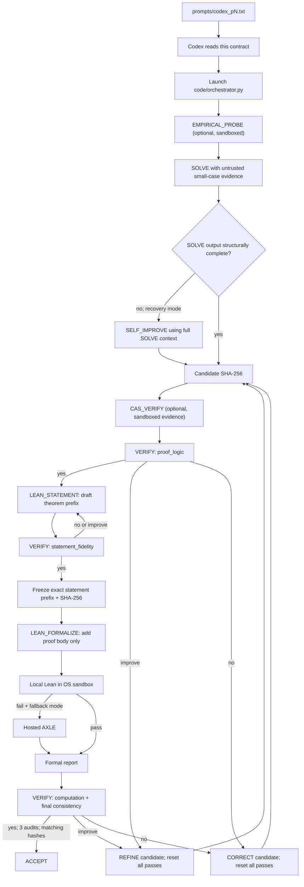

# Codex Desktop workflow

Codex launches and monitors the durable solver. It does not solve, grade, or
rewrite the olympiad proof itself.

## From prompt to accepted solution



### What each addition does

- `SELF_IMPROVE` is recovery, not a mandatory second solution. In the default
  `recovery` mode it runs only when `SOLVE` is empty, truncated, or lacks the
  required solution structure. It receives the original problem, probe
  evidence, pivot history, and partial SOLVE output. Use `always` only for
  experiments that need a forced independent review; use `off` to disable it.
- `LEAN_STATEMENT` translates only the natural-language claim into an
  `imo_problem ... := by` prefix. `statement_fidelity` reviews it before proof
  generation. A pass freezes the prefix bytes and SHA-256; a rejection
  redrafts only the statement.
- `LEAN_FORMALIZE` adds a proof body to the frozen prefix. It cannot improve
  the informal proof or change the reviewed statement. A prefix-changing
  generation or repair is rejected before execution.
- Local Lean checks syntax, proof terms, declaration kind, statement hash, and
  axioms. The report distinguishes the frozen source-prefix hash from Lean's
  elaborated-statement hash.
- AXLE is optional hosted Lean checking. With `fallback`, it is contacted only
  after local Lean fails. With `required`, both local Lean and AXLE must pass.
  AXLE never solves the problem, runs the probe, or decides acceptance.
- `CAS_VERIFY` and `CAS_COMPUTE` create untrusted computational evidence. Their
  scripts are policy-checked and sandboxed; output never becomes proof text
  automatically.

Statement drafting starts only after `proof_logic` passes. Formal proof
generation starts only after `statement_fidelity` freezes that statement.
Statement and proof failures get isolated retries and do not silently mutate
or reject the informal mathematics. Any informal refinement or correction
changes the candidate hash, clears all audit passes and formal state, and
requires a new statement review.

There is no separate classifier model call. Each audit must end with exactly:

```text
VERDICT: yes
VERDICT: improve
VERDICT: no
```

The orchestrator parses this last line and writes `classify_NN.md` as a
compatibility artifact. Missing or malformed verdicts fail closed as `no`.
Acceptance requires `proof_logic`, `statement_fidelity`, and `computation` on
the exact same candidate SHA-256 and frozen-statement SHA-256, plus the
selected formal gate.

## Prerequisites

Install the local dependencies:

```sh
python3 -m pip install -r requirements.txt
bash scripts/setup_lean.sh
```

Configure the model endpoint in the environment inherited by Codex:

```sh
export IMO_SOLVER_API_URL="https://model-host/v1/chat/completions"
export IMO_SOLVER_TOKEN="..."
export IMO_SOLVER_MODEL="..."
```

An optional distinct verifier model can be set with
`IMO_VERIFIER_MODEL`. Never place a model token in a prompt, source file,
artifact, or command line. As an alternative to `IMO_SOLVER_TOKEN`, the
orchestrator accepts `--api-key-file` only when that file has mode 0600.

For AXLE:

```sh
python3 -m pip install -r requirements-axle.txt
export AXLE_API_KEY="..."
```

The AXLE client currently requires Python 3.11 or newer.

Generated Python and local Lean require macOS `sandbox-exec`. The orchestrator
refuses to execute generated code without the OS sandbox. On unsupported
systems, explicitly select both `--validation-mode off` and `--lean-mode off`;
this weakens assurance and should not be used for an acceptance run.

## Launch

Create a fresh run directory and launch through `exec_command`, not `screen`:

```sh
RUN_DIR="/tmp/imo26-imo2026_p1-$(date -u +%Y%m%dT%H%M%SZ)"
mkdir -p "$RUN_DIR"
python3 code/orchestrator.py \
  --problem problems/imo2026_p1.txt \
  --run-dir "$RUN_DIR" \
  --output solutions/imo2026_p1.md \
  --self-improve recovery \
  --validation-mode sandboxed \
  --lean-mode required \
  --axle-mode fallback \
  --axle-environment lean-4.28.0 \
  >"$RUN_DIR/stdout.log" 2>"$RUN_DIR/stderr.log"
```

The model URL, token, and model come from the inherited environment. Save the
returned terminal session ID for `write_stdin` monitoring.

The P1-P6 Codex prompts deliberately request AXLE fallback. If the AXLE client
or key is unavailable, report the preflight error; do not silently change the
requested policy.

## Monitor

Thirty seconds after launch, inspect:

```sh
tail -20 "$RUN_DIR/progress.log"
tail -20 "$RUN_DIR/stderr.log"
cat "$RUN_DIR/state.json"
```

If an `ERROR` appears, diagnose it immediately. Otherwise poll the owned
terminal session no more than once every five minutes. Do not infer failure
from a UI polling timeout, create a second request, or monitor another task's
process.

When `VERIFY` completes, inspect the newest:

```text
run_XX/candidate_NN.md
run_XX/verify_YY.md
run_XX/verify_YY.json
run_XX/classify_YY.md
run_XX/candidate_NN_statement_frozen.lean
run_XX/lean_verify_NN_attempt_AA.txt
```

Report the actual mathematical issue, audit profile, verdict, candidate hash,
and local/AXLE status. Also state whether the verifier found the Lean statement
faithful. Token counts alone are not a substantive update.

Streaming reasoning and visible output are flushed every few seconds to
`reasoning_*.txt` and `reasoning_*.partial.md`. A 90-minute wall-clock timeout
preserves both and makes one bounded continuation attempt with a smaller
budget. `usage.jsonl` records every completed, retried, incomplete, and timed
out model attempt.

## Artifacts and state

The run directory contains:

- `progress.log` and current `state.json`;
- `usage.jsonl` with global token accounting;
- `failure_ledger.json` with cross-outer-run failure context;
- candidates, three audit reports, derived verdicts, and hash metadata;
- empirical/CAS source, stdout, stderr, and execution metadata;
- proposed/frozen Lean statements, proof source, and local/AXLE reports;
- on acceptance, `manifest.json` and the configured output file.

`state.json` is written after each state transition; pass counts are current.
The atomic `<output>.lock` prevents concurrent writers to one solution path and
is removed only by its owning process.

## Failure and cleanup

Endpoint or transport failures back off and retry the same outer-run number.
Authentication, endpoint-contract, and configuration failures stop
immediately. A candidate gets at most three critical correction failures before
the next outer run starts with a different-approach hint.

If the Codex task is stopped, its child process may remain alive. Inspect first:

```sh
bash scripts/cleanup.sh
```

Terminate only a PID or exact run directory that belongs to the stopped task:

```sh
bash scripts/cleanup.sh 12345
bash scripts/cleanup.sh /tmp/imo26-imo2026_p1-20260727T000000Z
```

Never use a broad `pkill` pattern and never terminate another task's run.
